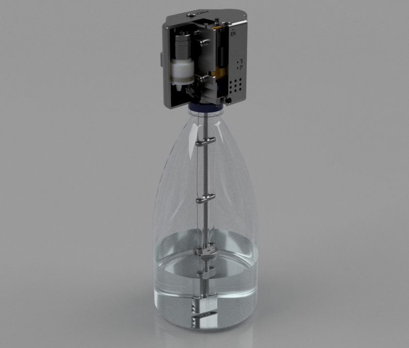

# AutoWaterPump

This simple DIY auto water pump is based on the ESP32 and features two independently configurable pumps (_right_ and _left_).
Additionally, it supports two sensors and operates on a 220V power supply.
<p align="center">
&nbsp;
</p>
The setup includes a button that, when pressed while the ECU is powering on, enables pairing mode.
In pairing mode, the ECU functions as an Access Point (AP) with the hotspot name `water-pump`.
Connect to this hotspot and navigate to `http://192.168.4.1:80/wifi` to enter the credentials for the primary Wi-Fi network.

The ECU also has two LEDs (_S_ for status, _P_ for power) and a buzzer, which provide the following notifications:

|                S Led & Buzzer             |                                     Meaning                                 |
|-------------------------------------------|-----------------------------------------------------------------------------|
| LED ON & Buzzer OFF                       | Wifi is not connected (yet)                                                 |
| LED blinking 1000ms interval & Buzzer OFF | The ECU is working as Access Point, so you can connect to it and setup WiFi | 
| LED blinking 100ms interval & Buzzer OFF   | mDNS issue                                                                  |
| LED ON & Buzzer ON                        | Time is not synchronized yet                                                |
| LED blinking 1000ms & Buzzer 1000ms       | The tank\bottle is empty                                                    |

__Be aware that the pumps I use, don't block water, so if the nozzles are lower than the bottle, water will spill due to the siphon effect.__

# API

The ECU(esp32) uses mDNS, so the ECU can be accessible by `water-pump.local`.

For example: `http://water-pump.local:80/get`

__Note:__ it works only if your router and OS support that.

The core provides several endpoints such as:

- `/set` - sets the scheduler for both pumps and time zone. The only acceptable method is POST. The body must be JSON format. Config example:
    ```
    {
        "left": {
            "ds": 65,
            "th": 14,
            "tm": 36,
            "v": 400
        },
        "right": {
            "ds": 64,
            "th": 12,
            "tm": 00,
            "v": 800
        },
        "tz": "CET-1CEST"
    }
    ```
     `left` or `right` has to include:
    - `ds` - on whic days to trigger the pumps. The bits of the number represents target days, where the first bit is Sunday, the secod bit is Monday etc. For example: number __1__ (in bits: 0000 0001) represents Sanday; number __42__ (0010 1010) represents Monday, Wednesday and Friday. If `ds` is set to zero, the target pump is disabled.
    - `th` - time hour. Points at what time(hour) to trigger the target pump. The value is from 0-23.
    - `tm` - time minutes. Points at what time(minutes) to trigger the target pump. The value is from 0-59.
    - `v` - the amount of water to be pumped in millilitres.

    `tz` - time zone. The default value is CET-1CEST.

    If the config is correct, you'll get a response `OK` with 200 code.

- `/get` - returns the current config for both pumps. The response is exactly the same as the body for `/set`, however, the keys `ct` (current time on the ECU) and `tz` (time zone) are added.
- `/wifi` - is used to set up WIFI credentials. If it's GET method - html form for ssid and password is returned. If it's POST, then there should be two arguments: _ssid_ and _pass_. Once the credentials are set, the ECU must be rebooted. 

# Components

|                         Name                        | Quantity |                          Note                           |
|-----------------------------------------------------|----------|---------------------------------------------------------|
| ESP-WROOM-32                                        |     1    |  Main ECU                                               |
| S-36-12 Power Supply                                |     1    | Power supply, 110/230v 3A                               |
| LM2596 DC-DC                                        |     1    | It's used to decrease voltage to 5v for the ECU         |
| Micro Water Pump 365 Motor DC 12V                   |     2    | [Link for motors]                                       |
| Transparent PVC Plastic Hoses ID 6mm x OD 8mm       |    N\A   | [Link for hoses]                                        |
| JY039 socket                                        |     2    | It's used to connect sensors                            |
| momentary push button switch                        |     1    |                                                         |
| IRLZ44N                                             |     2    | It's used to turn on the motors                         |
| Buzzer                                              |     1    |                                                         |
| 3mm led                                             |     2    |                                                         |
| Resistor 3K                                         |     2    | For the leds                                            |
| Resistor 100                                        |     2    |                                                         |
| Resistor 10K                                        |     2    |                                                         |
| Reed switch                                         |     1    |                                                         |
| SB5100 Diode                                        |     2    | It's used to protect the mosfets. Smaller can be used   |
| Ceramic Capacitor +-1.5nF                           |     6    | It's used to supress electric noises from motor         |
| PCB Universal pad protoboard 47x72mm                |     1    |                                                         |
| Rounded Screw M3x6                                  |    10    | For fixing the motors and LM2596                        |
| Flat Screw M3x10                                    |     8    | For the cover                                           |
| Rounded Screw M3x5                                  |     4    | For the PCB                                             |
| Socket Screw M3x16 + Nut M3                         |     1    |                                                         |
| Socket Screw M3x10 + Nut M3                         |     1    | For the Power Supply                                    |
| Socket Screw M3x10 + Nut M3                         |     2    | For the Power Supply                                    |
| Rounded Screw M3x16                                 |     3    |                                                         |
| Flat Screw M3x6                                     |     1    |                                                         |
| Neon Magnet 4x7                                     |     1    |                                                         |
| Aluminium Pipe DO6.3xDI2.8x??                       |     1    |                                                         |

[Link for motors]:https://www.aliexpress.com/item/1005006118991709.html?spm=a2g0o.order_list.order_list_main.17.1bb61802jnl1rZ
[Link for hoses]:https://www.aliexpress.com/item/1005004689897424.html?spm=a2g0o.order_list.order_list_main.11.1bb61802jnl1rZ
